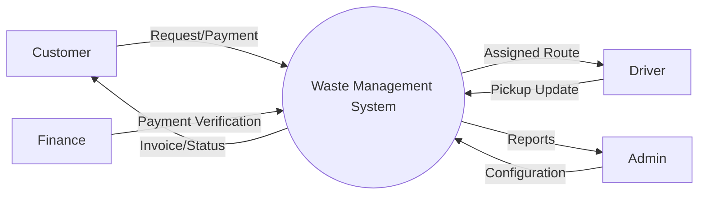
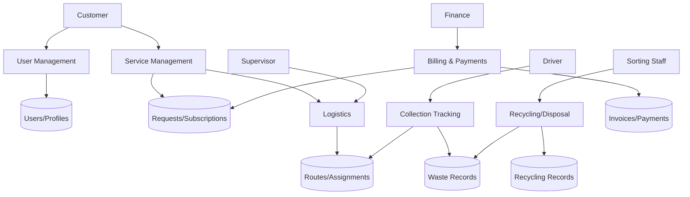
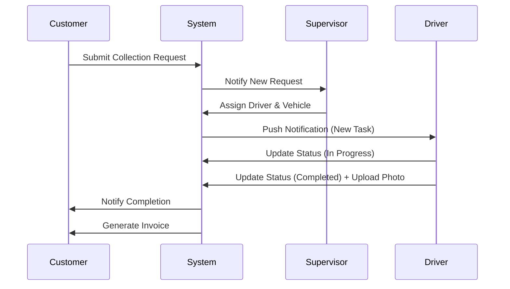
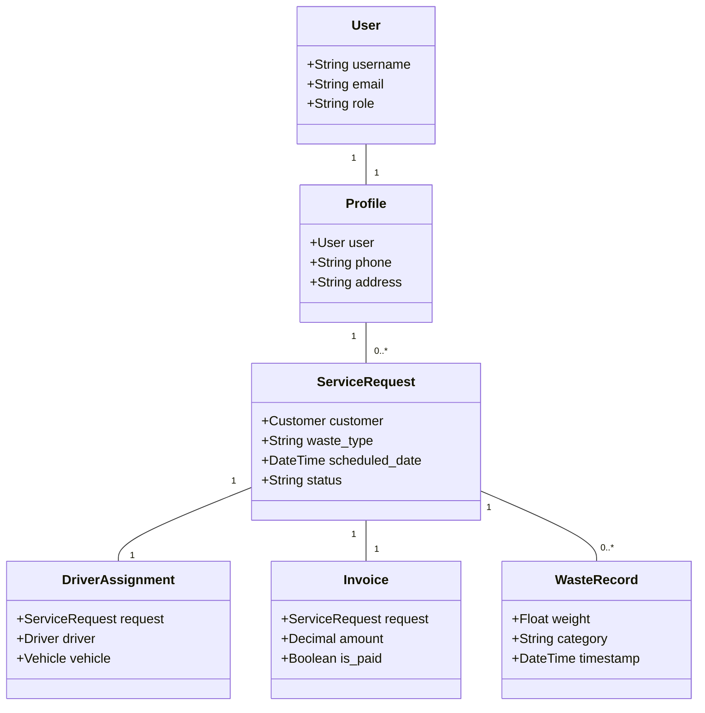

# Waste Management and Recycling System (WMRS) - Design Documentation

## 1. Problem Statement
Many waste management companies in developing regions like Rwanda still rely on manual processes for customer registration, scheduling, and billing. This leads to inefficiencies such as missed collections, inaccurate recycling data, delayed payments, and poor customer communication. There is a critical need for an integrated digital platform that automates the entire lifecycle of waste—from collection requests to recycling and final disposal.

## 2. Objectives
- **Automate Operations:** Streamline scheduling, truck assignments, and pickup tracking.
- **Enhance Transparency:** Provide real-time status updates to customers and management.
- **Promote Sustainability:** Track recycling metrics and waste classification accurately.
- **Improve Financial Management:** Automate invoicing and payment tracking.
- **Data-Driven Decisions:** Generate comprehensive reports for operational and environmental analysis.

## 3. Scope
The system covers:
- Public-facing marketing website.
- Role-based dashboards for 8 user types.
- Full waste lifecycle tracking (Pickup -> Sorting -> Recycling/Disposal).
- Logistics management (Routes, Vehicles, Drivers).
- Financial modules (Invoices, Payments).
- Customer service (Complaints, Feedback).

## 4. User Roles
1. **Public Visitor:** Browse services, view projects, contact company.
2. **Customer:** Manage profile, request pickups, subscribe, pay bills, complain.
3. **Driver/Collection Staff:** View assigned routes, update pickup status, upload proof.
4. **Sorting/Recycling Staff:** Record incoming waste, sort into categories, record recycled output.
5. **Operations Supervisor:** Manage schedules, assign drivers/trucks, monitor progress.
6. **Finance Officer:** Approve payments, manage invoices, generate revenue reports.
7. **Company Manager:** High-level reports, strategic overview, system monitoring.
8. **System Administrator:** Manage users, system settings, content management.

## 5. Functional Requirements
- **Auth:** Secure registration, login, and Role-Based Access Control (RBAC).
- **Collection:** Request one-time or recurring pickups.
- **Logistics:** Route optimization and vehicle tracking.
- **Recycling:** Detailed tracking of waste categories (Plastic, Paper, Organic, etc.).
- **Finance:** Integration with payment gateways (simulated), automated invoicing.
- **Reports:** Exportable PDF/Excel reports and interactive charts.

## 6. Non-Functional Requirements
- **Security:** CSRF protection, password hashing, secure session management.
- **Scalability:** Modular Django architecture to handle increasing data/users.
- **Usability:** Responsive design for mobile (drivers) and desktop (admin).
- **Performance:** Optimized queries and caching for fast dashboard loading.

## 7. Use Case Diagrams

```mermaid
useCaseDiagram
    actor "Public Visitor" as PV
    actor "Customer" as C
    actor "Driver" as D
    actor "Sorting Staff" as S
    actor "Supervisor" as SV
    actor "Finance" as F
    actor "Admin" as A

    package "System" {
        usecase "Register/Login" as UC1
        usecase "Request Collection" as UC2
        usecase "Assign Driver/Truck" as UC3
        usecase "Update Pickup Status" as UC4
        usecase "Record Recycling" as UC5
        usecase "Generate Invoice" as UC6
        usecase "Process Payment" as UC7
        usecase "Submit Complaint" as UC8
        usecase "View Reports" as UC9
    }

    PV --> UC1
    C --> UC1
    C --> UC2
    C --> UC7
    C --> UC8
    SV --> UC3
    D --> UC4
    S --> UC5
    F --> UC6
    F --> UC7
    A --> UC9
    A --> UC1
```

## 8. Data Flow Diagrams (DFD)

### Context Diagram (Level 0)


### Level 1 DFD


## 9. Sequence Diagram: Waste Collection Request


## 10. Class Diagram (Models)


## 11. Database Design (Django Apps)
- **Accounts:** Custom User model, Profiles (Customer, Staff).
- **Services:** Waste categories, service types.
- **Collection:** Requests, Subscriptions, Routes, Vehicle, DriverAssignment, Pickup tracking.
- **Recycling:** Sorting, RecyclingRecord, DisposalRecord.
- **Payments:** Invoice, Payment tracking.
- **Complaints:** Complaint model, Feedback.
- **Core:** Website content, contact messages.

## 12. UI Page List
- **Public:** Index, About, Services, Contact, Request Quote.
- **Customer Dash:** My Requests, Subscriptions, Payments, Complaints.
- **Staff Dash:** Assigned Tasks, Route Maps, Sorting Forms.
- **Management Dash:** Statistics, Revenue Charts, Staff Performance.

## 13. Development Plan
1. **Setup:** Django project, core apps, custom user model.
2. **Models:** Define all fields and relationships.
3. **Admin:** Customize Django admin for easy data management.
4. **Backend:** Logic for assignment, status updates, and invoicing.
5. **Frontend:** Base templates, CSS (Vanilla + Grid/Flexbox), JS charts.
6. **Testing:** Unit tests for core business logic.
7. **Deployment:** Configuration for production.
