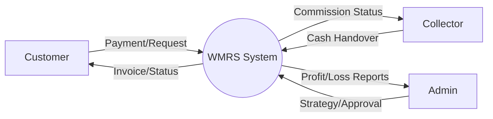
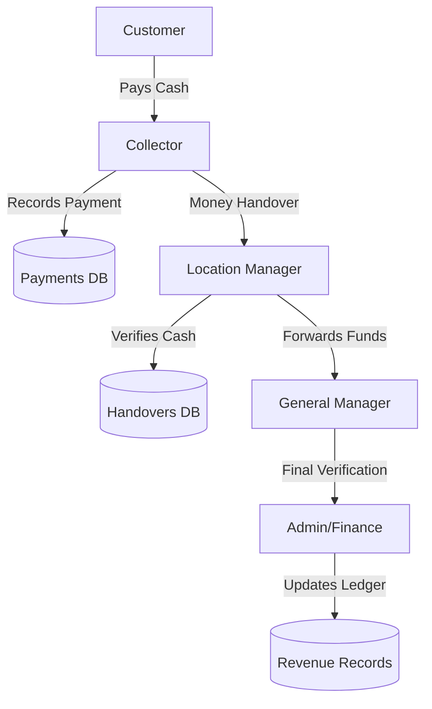
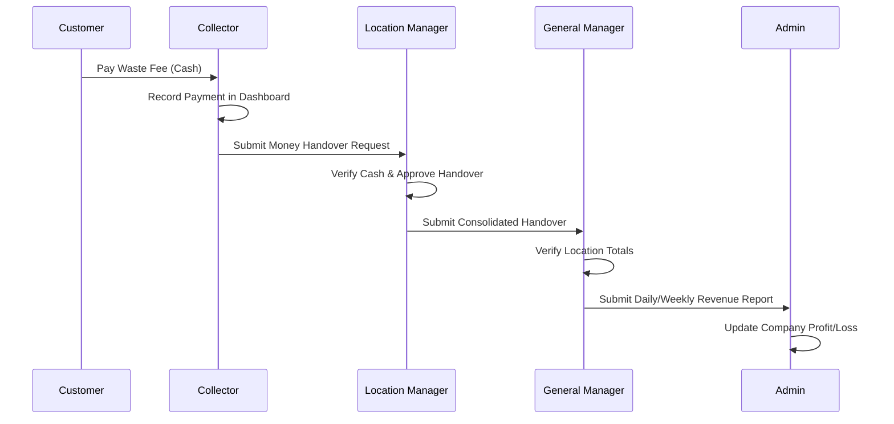
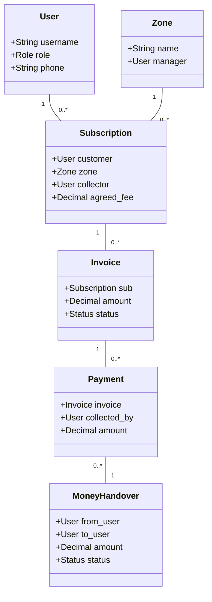

# Waste Management and Recycling System (WMRS) - Design Documentation

## 1. Problem Statement
Agruni Company Limited and similar waste management entities require a robust digital system to manage the complex flow of waste collection, staff assignments, and financial handovers in Rwanda. Manual tracking leads to inefficiencies and financial leaks.

## 2. Objectives
- **Operational Flow:** Represent the real chain of responsibility from Collector to Admin.
- **Financial Transparency:** Track every RWF from customer payment to company profit.
- **Sustainability:** Monitor recycling and disposal metrics.

## 3. User Roles (10 Roles Supported)
1. **Admin / Boss:** Full oversight, financial reports, system configuration.
2. **Secretary / Registrar:** Customer registration, service agreements, zone assignments.
3. **General Manager:** Operational strategy, cross-location monitoring, handover verification.
4. **Location Manager:** Zone-specific management, collector supervision, cash reception.
5. **Finance Officer:** Invoicing, payment verification, expense management.
6. **Supervisor:** Fleet management, driver assignments, route oversight.
7. **Collector:** Front-line collection, cash payment recording, manager handovers.
8. **Driver:** Waste transport, vehicle maintenance reporting.
9. **Customer:** Service requests, online payments, complaint submission.
10. **Sorting Staff:** Waste classification, recycling/disposal recording.

## 4. System Diagrams

### 4.1 Use Case Diagram
```mermaid
useCaseDiagram
    actor "Customer" as C
    actor "Collector" as CO
    actor "Location Manager" as LM
    actor "Secretary" as SEC
    actor "Admin" as AD
    actor "Driver" as DR
    actor "Supervisor" as SV

    package "WMRS System" {
        usecase "Register/Login" as UC1
        usecase "Request Collection" as UC2
        usecase "Record Payment" as UC3
        usecase "Handover Money" as UC4
        usecase "Verify Handover" as UC5
        usecase "Assign Collector/Zone" as UC6
        usecase "Dispatch Driver" as UC7
        usecase "View Profit/Loss" as UC8
    }

    C --> UC1
    C --> UC2
    SEC --> UC6
    CO --> UC3
    CO --> UC4
    LM --> UC5
    SV --> UC7
    AD --> UC8
```

### 4.2 Context Diagram (Level 0 DFD)


### 4.3 Level 2 DFD: Payment & Money Handover Flow


### 4.4 Sequence Diagram: Customer Payment to Boss


### 4.5 Class Diagram (Major Models)


## 5. Operational Flow
1. **Registration:** Secretary registers Customer and assigns them to a **Zone** and **Collector**.
2. **Collection:** Collector visits Customer, marks waste collected, and records payment.
3. **Logistics:** Supervisor dispatches Driver to transport waste to recycling.
4. **Finance:** Collector hands over cash to Location Manager; Finance verifies invoices.
5. **Management:** Admin views real-time Profit/Loss and performance by location.
